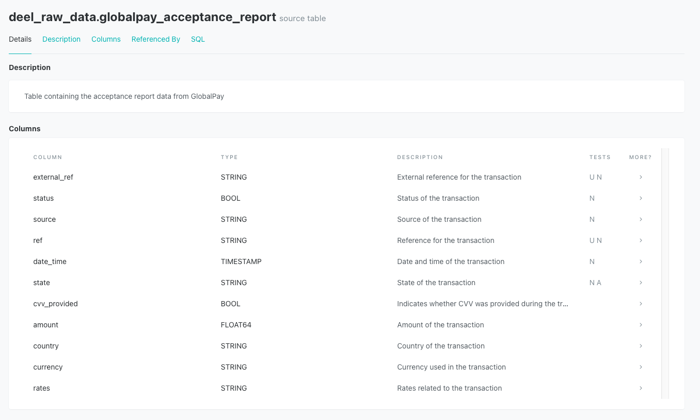
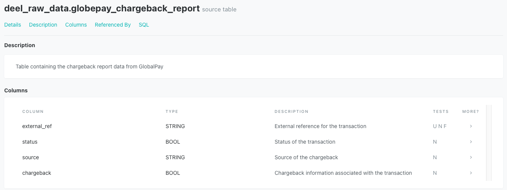
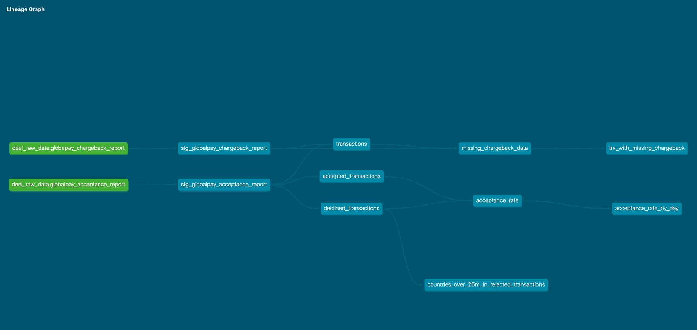
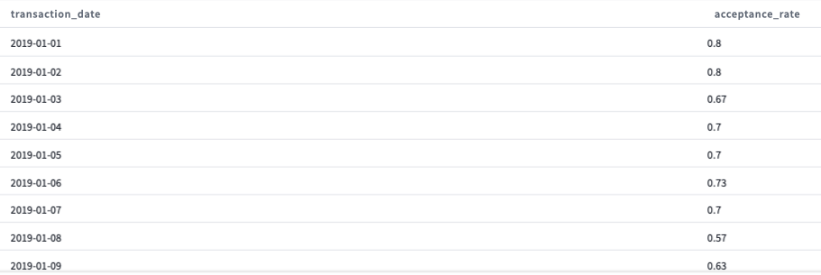
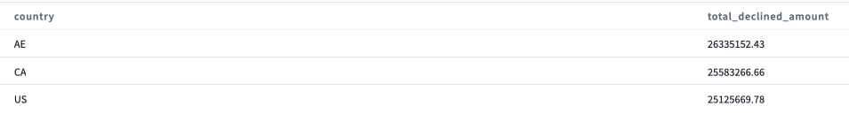
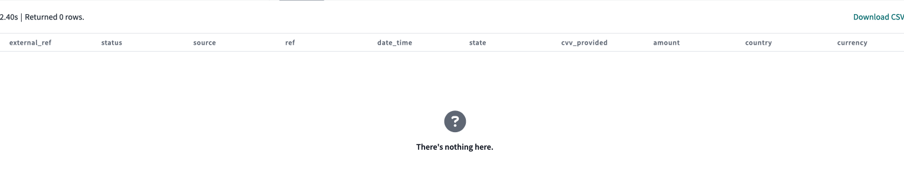

# deel_challenge
This repository is used to apply for the position of analytics engineer at deel.

## 1. Preliminary Data Exploration

In this data analysis project, we utilized two different data sources to gain insights into the Global Payment acceptance and chargeback transactions. Each data source provides different aspects of the transactional data, contributing to a comprehensive analysis of the payment processing ecosystem. Below is an overview of the data sources used: 

We want to answer the following questions: 

1. What is the acceptance rate over time?
2. List the countries where the amount of declined transactions went over $25M
3. Which transactions are missing chargeback data?

### Key Insights

During the preliminary data exploration, I saw that the data from both the GlobalPay Acceptance Report and the GlobalPay Chargeback Report is relatively clean and well-structured. The absence of significant data anomalies, missing numbers, or discrepancies indicates that GlobalPay has a strong data management procedure in place. This cleanliness is critical because it provides a strong foundation for developing reliable data models and performing correct analyses.

I emphasised the importance of data validation as part of our data modelling strategy. By implementing strict data quality tests and assertions at various stages of the data pipeline, we were able to identify and correct any possible errors early on. Data validation helps us in maintaining data consistency, adhering to business rules, and identifying conflicts between source data and model outputs.

The country with the lowest transaction acceptance rate is the United States, while the country with the highest transaction acceptance rate is the United Kingdom.

The acceptance rate has been quite consistent in the time span given, with a simple average of 70%.

At the moment, no transactions have a missing chargeback.

## 2. Model Descriptions

The staging schema contains the tables that get data from the source tables directly. Some tests are running at that layer to ensure that the data is valid and trustworthy.

The intermediate schema contains all of the logic. Here, I performed all of the computations required to answer the questions we wish to answer. These models can be reused to develop upstream models or for different marts.

The marts schema is used to organise where our models will be utilised; in this case, I created a "Finance" mart that would be used by the team. 

## 3. DAG Visualization

## 3. Documentation
All the models are documented in the shcema.yml files. 

## Model Results 

### acceptance_rate_over_time:

### countries_over_25m_in_rejected_transactions:

### trx_with_missing_chargeback:

Note: For the project I used BigQuery as datawarehouse connected to DBT cloud.

